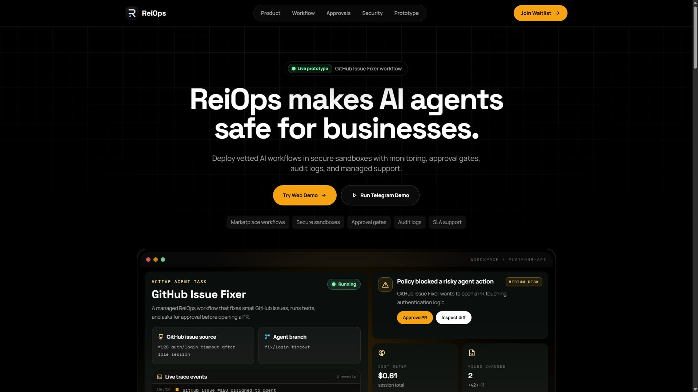
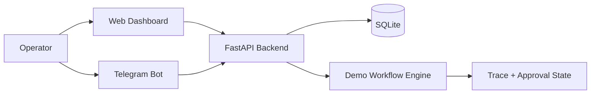

# ReiOps

**ReiOps makes AI agents safe for businesses.**

ReiOps is a managed operations layer for business-ready AI agents. It turns raw agents and scripts into vetted workflows with secure sandboxes, live execution traces, human approval gates, audit logs, cost tracking, and managed support.

- Live demo: https://reiops.xyz/demo
- Landing page: https://reiops.xyz
- Telegram demo: https://t.me/ReiOps_bot?start=demo



## Why ReiOps?

AI agents are becoming cheap and abundant, but businesses cannot safely give random agents access to codebases, CRMs, infrastructure, customer data, or internal workflows.

The scarce layer is no longer the agent itself. The scarce layer is trust:

- Which agents are allowed to run?
- What tools and data can they access?
- What did they do?
- Who approved risky actions?
- How much did the workflow cost?
- Who supports the workflow when it fails?

ReiOps is building the trusted distribution and operations layer for agentic work.

## Demo: GitHub Issue Fixer

The current demo shows a managed AI workflow for engineering teams:

1. A GitHub issue is assigned to an AI agent.
2. ReiOps runs the workflow in a secure sandbox.
3. The agent inspects code, edits files, and runs tests.
4. ReiOps records the full execution trace.
5. A policy gate blocks risky actions.
6. A human approves PR creation from the web dashboard or Telegram.
7. The completed workflow is stored as an audit trail.

This is a simulated demo workflow. No real production repository is modified.

## Product Layers

### Managed Workflow Marketplace

Curated, vetted AI workflows for common business tasks:

- GitHub issue fixing
- sales research
- customer support drafting
- invoice processing
- internal operations automation

### Control Plane

A governance and operations layer for agent execution:

- secure sandboxing
- scoped tool permissions
- live traces
- approval gates
- audit logs
- cost tracking
- managed support

### Telegram Operator Layer

Teams can monitor and approve critical agent actions directly from Telegram, while the web dashboard keeps the shared workflow state and audit history.

## Architecture

The demo stack:

- Next.js + Tailwind web app
- FastAPI backend
- SQLite state store
- aiogram Telegram bot
- Docker Compose deployment
- Caddy-compatible reverse proxy setup



## Repository Structure

```text
apps/
  web/        Next.js dashboard and landing page
  api/        FastAPI demo backend
  bot/        aiogram Telegram operator bot
docs/         product, architecture, deployment, demo notes
public/       brand assets and screenshots
docker-compose.yml
.env.example
```

## Local Development

```bash
cp .env.example .env
docker compose --env-file .env up -d --build
```

Open:

- Web: http://localhost:3000
- Demo: http://localhost:3000/demo
- API health: http://localhost:8000/health
- Current run API: http://localhost:8000/api/runs/current

## Environment Variables

```env
PUBLIC_WEB_URL=http://localhost:3000
WEB_DEMO_URL=http://localhost:3000/demo
API_URL=http://api:8000
NEXT_PUBLIC_API_URL=http://localhost:8000
NEXT_PUBLIC_TELEGRAM_BOT_URL=https://t.me/ReiOps_bot?start=demo
TELEGRAM_BOT_TOKEN=
DATABASE_URL=sqlite:////data/reiops_demo.db
```

Do not commit `.env` files or real bot tokens.

## Docs

- [Product Narrative](docs/PRODUCT.md)
- [Architecture](docs/ARCHITECTURE.md)
- [Security Model](docs/SECURITY_MODEL.md)
- [Demo Script](docs/DEMO_SCRIPT.md)
- [Deployment](docs/DEPLOYMENT.md)
- [Roadmap](docs/ROADMAP.md)

## Security Notes

- The public demo uses simulated workflow data.
- No real GitHub repository or production system is modified by the demo.
- The long-term ReiOps model is built around sandboxed execution, scoped permissions, approval gates, and auditability.
- Telegram tokens and deployment secrets must be provided through local environment variables only.

## Status

ReiOps is an early prototype built for customer discovery and accelerator applications. The current demo focuses on the core wedge: making AI agents safe, observable, and governable for business workflows.

## License

MIT — see [LICENSE](LICENSE).
