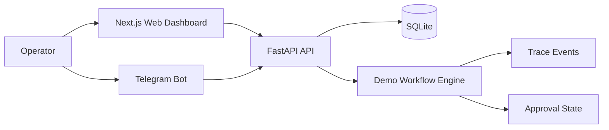

# Architecture

This repository contains a standalone ReiOps demo stack.

## Components

### `apps/web`

Next.js + Tailwind web app.

Responsibilities:

- landing page
- product demo dashboard
- workflow marketplace view
- live trace UI
- approval UI
- audit/cost/risk panels
- links into the Telegram operator flow

### `apps/api`

FastAPI service with SQLite-backed state.

Responsibilities:

- current demo run state
- start/reset workflow endpoints
- approval/reject/request-changes endpoints
- trace events
- demo metadata, costs, changed files, commands, and risk labels

### `apps/bot`

aiogram Telegram bot using long polling.

Responsibilities:

- `/start`, `/demo`, `/status` commands
- launch the same demo workflow as the web UI
- send progress updates
- request approval when policy blocks risky actions
- approve/reject/request changes through inline buttons

### SQLite

The demo uses SQLite so the stack can run on a small VPS or laptop without extra infrastructure.

For production, this would likely become Postgres with workspace/team isolation and append-only audit storage.

## Demo State Flow

1. Operator launches workflow from web or Telegram.
2. API creates a `DemoRun`.
3. Scenario engine schedules trace events.
4. Web polls `/api/runs/current` and updates the dashboard.
5. Bot polls/queries the same API state for Telegram updates.
6. Workflow reaches `waiting_approval`.
7. Operator approves from web or Telegram.
8. API records final approval and marks workflow as completed.

## Deployment Shape

The deployment target is intentionally simple:

- Docker Compose for web/API/bot
- Caddy for HTTPS and reverse proxy
- SQLite volume for demo state
- no external queue, cloud database, or managed service required

This keeps the demo cheap and easy to run while showing the product concept clearly.
